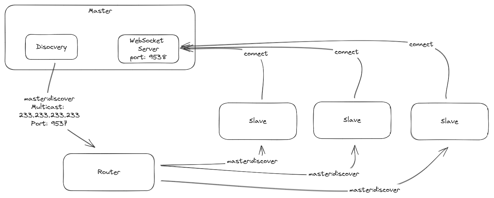

# Auto Discovery

Since Masters and Slaves are in the same LAN network, we can easily discover them using Multicast. The Master will send a message via Multicast to advertise its hosts and port for the Slaves to connect to (WebSocket).



## How it works:

1. Master listens to WebSocket Server. This server can be any port, but default is `9358`.
1. Slaves listen to Multicast message on `233.233.233.233:9357`
1. Master sends master:discover via the Multicast group above
1. Slave receives information regarding the Master and its WebSocket Server
1. Slave connects to WebSocket server
1. Now we have a 2-way communication between Master and Slave.

## Protocols

This message is sent by the Master to the Multicast group to advertise its host and port for the Slaves to connect to.

```json
{
  "type": "master:discover",
  "data": {
    "uuid": "master-uuid", // unique identifier for the master
    "name": "Name of the master" // usually, it should be the user name.
    "hosts": [
      "192.168.1.2",
      "localhost",
      "192.168.13.2"
    ],
    "port": 9358
  }
}
```
